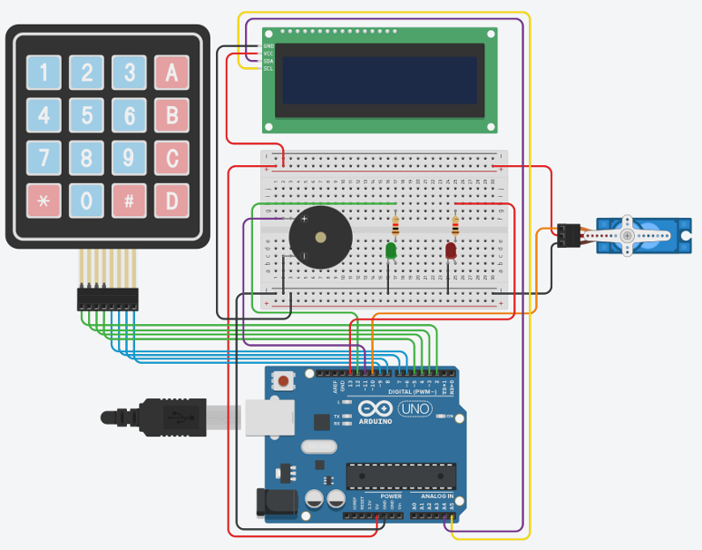
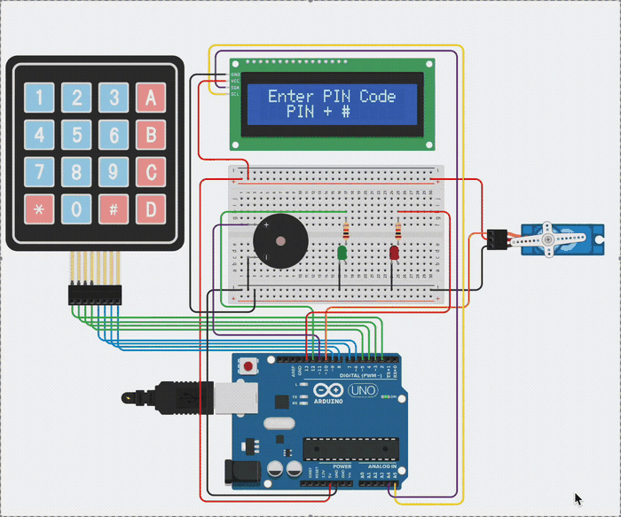
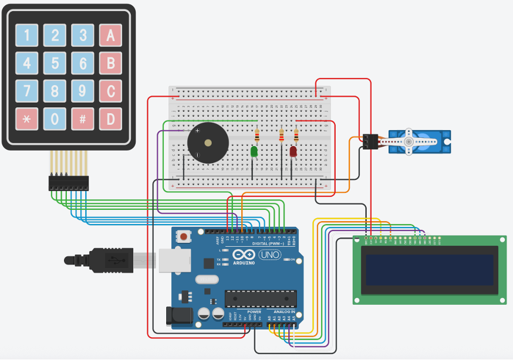

# PIN-Based Access Control System (Arduino + Tinkercad)

An Arduino access control system built and simulated in [Tinkercad](https://www.tinkercad.com/), developed in two iterations: a working PIN-and-lock prototype (**TP2**), followed by a hardened version adding an armed/disarmed security mode, intrusion alarm, and event logging (**TP3**).

This document walks through both versions, the hardware used in each, and — importantly — *why* a hardware/library decision made in TP2 had to be revisited in TP3.

---

## Table of Contents

- [Project Evolution](#project-evolution)
- [TP2 — PIN Access Control (I2C LCD)](#tp2--pin-access-control-i2c-lcd)
  - [Circuit Diagram](#tp2-circuit-diagram)
  - [Live Demo](#tp2-live-demo)
  - [Bill of Materials](#tp2-bill-of-materials)
  - [Pinout / Wiring Table](#tp2-pinout--wiring-table)
  - [Required Libraries](#tp2-required-libraries)
  - [How It Works](#tp2-how-it-works)
- [TP3 — Access Control with Protected Mode & Event Logging](#tp3--access-control-with-protected-mode--event-logging)
  - [Circuit Diagram](#tp3-circuit-diagram)
  - [Bill of Materials](#tp3-bill-of-materials)
  - [Pinout / Wiring Table](#tp3-pinout--wiring-table)
  - [Required Libraries](#tp3-required-libraries)
  - [How It Works](#tp3-how-it-works)
- [Why the LCD Approach Changed in TP3](#why-the-lcd-approach-changed-in-tp3)
- [Running the Project](#running-the-project)
- [Security Considerations & Limitations](#security-considerations--limitations)
- [Possible Improvements](#possible-improvements)
- [References](#references)

---

## Project Evolution

| | TP2 | TP3 |
|---|---|---|
| **Goal** | Baseline PIN-controlled door lock | Armed security system with intrusion alarm and auditing |
| **LCD interface** | I2C (2-wire) | Parallel (6-wire, direct) |
| **PIN(s)** | Single user PIN | User PIN **+** Admin PIN |
| **Failed-attempt handling** | Temporary lockout only | Temporary lockout **or** persistent intrusion alarm (mode-dependent) |
| **Event logging** | None | Serial Monitor, timestamped |
| **Source file** | [`TP2.cpp`](TP2.cpp) | [`TP3.cpp`](TP3.cpp) |

Both versions share the same physical core — keypad, servo lock, buzzer, and status LEDs — so the design decisions below build directly on top of one another.

---

## TP2 — PIN Access Control (I2C LCD)

The first version implements a straightforward access-control loop: enter a 4-digit PIN on the keypad, and the servo "unlocks" the door if it's correct. Three consecutive wrong attempts trigger a temporary 10-second lockout. Status is shown on a 16x2 LCD connected over **I2C**, which only needs two signal wires (`SDA`, `SCL`) instead of the six required by a parallel LCD — a sensible choice for keeping the wiring simple in a first iteration.

### TP2 Circuit Diagram

<p align="center">
  
</p>

### TP2 Live Demo

<p align="center">
  
</p>

### TP2 Bill of Materials

| # | Component | Qty | Notes |
|---|-----------|-----|-------|
| 1 | Arduino Uno R3 | 1 | Main microcontroller |
| 2 | 4x4 Matrix Keypad | 1 | PIN entry |
| 3 | Micro Servo Motor | 1 | Simulates the door lock |
| 4 | Piezo Buzzer | 1 | Audible feedback (success / error tones) |
| 5 | LED — Green | 1 | Access granted / positive feedback |
| 6 | LED — Red | 1 | Access denied feedback |
| 7 | Resistor 1 kΩ | 2 | Current-limiting resistors, one per LED |
| 8 | 16x2 Character LCD with **I2C backpack** | 1 | Connected via `SDA`/`SCL`, only 2 signal wires |
| 9 | Breadboard | 1 | Prototyping |
| 10 | Jumper wires | ~16 | Connections |
| 11 | USB cable | 1 | Power + programming |

### TP2 Pinout / Wiring Table

| Component | Signal | Arduino Pin | Purpose |
|-----------|--------|-------------|---------|
| Keypad 4x4 | ROW1–ROW4 | D2, D3, D4, D5 | Row scan lines |
| Keypad 4x4 | COL1–COL4 | D6, D7, D8, D9 | Column scan lines |
| Servo (door lock) | Signal | D10 | PWM signal controlling lock position |
| Servo (door lock) | GND | GND | Ground |
| Piezo Buzzer | + | D11 | Tone generation |
| Piezo Buzzer | – | GND | Ground |
| LED Green | Anode | D12 (via 1 kΩ resistor) | Positive feedback |
| LED Green | Cathode | GND | Ground |
| LED Red | Anode | D13 (via 1 kΩ resistor) | Negative feedback |
| LED Red | Cathode | GND | Ground |
| LCD 16x2 (I2C) | VCC / GND | 5V / GND | Power |
| LCD 16x2 (I2C) | SDA | A4 | I2C data line |
| LCD 16x2 (I2C) | SCL | A5 | I2C clock line |

### TP2 Required Libraries

| Library | Used for |
|---------|----------|
| [`Wire.h`](https://www.arduino.cc/reference/en/language/functions/communication/wire/) | I2C bus communication |
| `Adafruit_LiquidCrystal.h` | I2C-based control of the 16x2 LCD |
| [`Keypad.h`](https://www.arduino.cc/reference/en/libraries/keypad/) | Row/column scanning of the 4x4 matrix keypad |
| [`Servo.h`](https://www.arduino.cc/reference/en/libraries/servo/) | PWM control of the lock servo |

### TP2 How It Works

- The user enters a PIN and presses `#`.
- If it matches `CORRECT_PIN`, the green LED lights, a success tone plays, and the servo opens then re-closes the lock after `DOOR_OPEN_MS`.
- If it doesn't match, the red LED lights, an error tone plays, and `fails` is incremented.
- After `MAX_FAILS` (3) wrong attempts, the system enters a non-blocking lockout for `LOCKOUT_MS` (10s), using `millis()` so the LCD countdown keeps updating instead of freezing on a `delay()`.
- Pressing `C` at any point clears the current input.

---

## TP3 — Access Control with Protected Mode & Event Logging

TP3 keeps the same access-control core but adds a real security layer on top: an **armed ("Protected") mode**, an **admin PIN**, an **intrusion alarm**, and **timestamped event logging** over the Serial Monitor — the kind of audit trail a real access-control system would need.

### TP3 Circuit Diagram

<p align="center">
  
</p>

### TP3 Bill of Materials

| # | Component | Qty | Notes |
|---|-----------|-----|-------|
| 1 | Arduino Uno R3 | 1 | Main microcontroller |
| 2 | 4x4 Matrix Keypad | 1 | PIN entry |
| 3 | Micro Servo Motor | 1 | Simulates the door lock |
| 4 | Piezo Buzzer | 1 | Audible feedback (success / error / alarm tones) |
| 5 | LED — Green | 1 | Access granted / positive feedback |
| 6 | LED — Red | 1 | Access denied / alarm indicator |
| 7 | Resistor 1 kΩ | 2 | Current-limiting resistors, one per LED |
| 8 | 16x2 Character LCD (**parallel**, non-I2C) | 1 | Directly wired to analog pins `A0`–`A5` |
| 9 | Breadboard | 1 | Prototyping |
| 10 | Jumper wires | ~20 | More wires than TP2 due to the parallel LCD interface |
| 11 | USB cable | 1 | Power + programming |

### TP3 Pinout / Wiring Table

| Component | Signal | Arduino Pin | Purpose |
|-----------|--------|-------------|---------|
| Keypad 4x4 | ROW1–ROW4 | D2, D3, D4, D5 | Row scan lines |
| Keypad 4x4 | COL1–COL4 | D6, D7, D8, D9 | Column scan lines |
| Servo (door lock) | Signal | D10 | PWM signal controlling lock position |
| Servo (door lock) | GND | GND | Ground |
| Piezo Buzzer | + | D11 | Tone generation |
| Piezo Buzzer | – | GND | Ground |
| LED Green | Anode | D12 (via 1 kΩ resistor) | Positive feedback |
| LED Green | Cathode | GND | Ground |
| LED Red | Anode | D13 (via 1 kΩ resistor) | Negative feedback / alarm |
| LED Red | Cathode | GND | Ground |
| LCD 16x2 (parallel) | RS, EN, D4–D7 | A0, A1, A2, A3, A4, A5 | Direct control lines (see [`LiquidCrystal`](https://docs.arduino.cc/libraries/liquidcrystal) constructor) |
| LCD 16x2 (parallel) | VCC / GND | 5V / GND | Power |

### TP3 Required Libraries

| Library | Used for |
|---------|----------|
| [`LiquidCrystal.h`](https://docs.arduino.cc/libraries/liquidcrystal) | Direct (parallel) control of the 16x2 LCD |
| [`Keypad.h`](https://www.arduino.cc/reference/en/libraries/keypad/) | Row/column scanning of the 4x4 matrix keypad |
| [`Servo.h`](https://www.arduino.cc/reference/en/libraries/servo/) | PWM control of the lock servo |

> Note that `Wire.h` and `Adafruit_LiquidCrystal.h` are no longer used — see [Why the LCD Approach Changed in TP3](#why-the-lcd-approach-changed-in-tp3) below.

### TP3 How It Works

**State & configuration:**

```cpp
#define USER_PIN     "1234"   // normal access PIN
#define ADMIN_PIN    "9999"   // arms/disarms Protected Mode, clears alarms
#define MAX_FAILS    3        // failed attempts before temporary lockout
#define LOCKOUT_MS   10000UL  // lockout duration (ms)
#define DOOR_OPEN_MS 3000UL   // how long the door stays "open"

bool protectedMode = false;  // is the system armed?
bool adminLockout  = false;  // is the system in intrusion-alarm state?
```

**Core functions:**

| Function | Responsibility |
|----------|-----------------|
| `beep(freq, ms)` | Plays a tone at a given frequency/duration, then silences the buzzer |
| `lcdMsg(l1, l2)` | Clears the LCD and writes two lines of text |
| `resetInput()` | Clears the current PIN input buffer |
| `showHome()` | Displays the idle screen — different message depending on `protectedMode` |
| `logEvent(msg)` | Prints a `[Ns] message` line to the Serial Monitor for auditing |

**Main loop logic:**

The `loop()` function is organized as a priority chain, checked on every iteration using `millis()` (never a blocking `delay()` for state timing, so the system stays responsive):

1. **Admin lockout / alarm state** — if `adminLockout` is `true`, the red LED and buzzer pulse every 1.5s regardless of keypad input, and the *only* way out is entering `ADMIN_PIN` followed by `#`.
2. **Temporary lockout** — if too many wrong PINs were entered in normal mode, the keypad is ignored and a countdown is shown until `lockedUntil` elapses.
3. **Admin PIN entered (`#`)** — toggles `protectedMode` on/off, with distinct LED/buzzer feedback and a Serial log entry.
4. **User PIN entered (`#`)** — correct PIN opens the door (servo + green LED + beep); wrong PIN triggers different behavior depending on mode:
   - **Normal mode:** increments `fails`, and locks out for `LOCKOUT_MS` after `MAX_FAILS` wrong attempts.
   - **Protected mode:** immediately sets `adminLockout = true` — no grace attempts, straight to alarm.
5. **Any other key** — appended to the input buffer, shown on the LCD as `*` characters.

---

## Why the LCD Approach Changed in TP3

TP2 used an **I2C LCD** (`Adafruit_LiquidCrystal.h` over `Wire.h`) — a good choice on its own, since it only needs two signal wires (`SDA`/`SCL`) instead of six, freeing up pins and simplifying the wiring.

The problem surfaced when TP3 added **Serial Monitor event logging** (`logEvent()`). In the Tinkercad simulation, running the I2C LCD library and the Serial Monitor at the same time produced unreliable behavior. Importantly, this was not a bug in the sketch's logic — it was a **compatibility issue between that specific I2C LCD library and simultaneous Serial Monitor use** inside the simulator. That distinction only became clear after searching Arduino/Tinkercad community forums, where other users had already hit and diagnosed the exact same conflict.

The fix was to drop the I2C abstraction entirely and wire the LCD **directly (in parallel)** to the Arduino using the standard `LiquidCrystal.h` library on analog pins `A0`–`A5`. This trades wiring simplicity (2 wires → 6 wires) for guaranteed compatibility with simultaneous Serial logging — a reasonable trade-off once auditability became a requirement.

| Aspect | TP2 (I2C LCD) | TP3 (Parallel LCD) |
|---|---|---|
| Library | `Wire.h` + `Adafruit_LiquidCrystal.h` | `LiquidCrystal.h` |
| Signal wires to LCD | 2 (`SDA`, `SCL`) | 6 (`RS`, `EN`, `D4`–`D7`) |
| Arduino pins used by LCD | A4, A5 | A0–A5 |
| Compatible with simultaneous Serial Monitor logging | No — conflict observed in simulation | Yes |

**Takeaway for other learners:** when a library "shouldn't" be causing a problem and the code looks correct, it's worth checking whether the issue is actually a library/platform incompatibility rather than a logic bug — community forums often surface these faster than general-purpose troubleshooting.

---

## Running the Project

1. Open the project in [Tinkercad Circuits](https://www.tinkercad.com/) (or wire it up on a real Arduino Uno following the pinout tables above).
2. Paste [`TP2.cpp`](TP2.cpp) or [`TP3.cpp`](TP3.cpp) into the code editor / Arduino IDE, matching the corresponding circuit.
3. For TP3, open the Serial Monitor at **9600 baud** to see timestamped event logs.
4. Default PINs:
   - **User PIN:** `1234` → opens the door
   - **Admin PIN (TP3 only):** `9999` → arms/disarms Protected Mode, and clears the alarm if the system is locked out
5. Try:
   - Entering the wrong PIN 3 times in normal mode → temporary 10s lockout.
   - **(TP3 only)** Entering `9999#` to arm Protected Mode, then entering a wrong PIN → persistent alarm until `9999#` is entered again.

---

## Security Considerations & Limitations

Both versions are **proof-of-concept** designs, not production-ready access control systems. Known limitations if deployed for real or connected to the Internet:

- **Hardcoded PINs** — all PINs are compiled directly into the firmware; anyone with physical/firmware access can read them.
- **No brute-force protection beyond a fixed lockout** — the temporary lockout (and, in TP3, the intrusion alarm) can be bypassed with a physical power cycle or hardware reset.
- **No encryption** — there is no secure communication channel; all logic is local.
- **No persistent logging** — in TP3, events are only sent to the Serial Monitor and are lost on reset; nothing is stored in non-volatile memory.
- **No tamper detection** — no mechanism detects enclosure opening or power-line tampering.
- **No secure firmware update path** — relevant if this were ever deployed as a real IoT device.

### Possible Improvements

- Store PINs outside the source code (e.g., in EEPROM) with at least basic obfuscation, and support longer/changeable codes.
- Physically isolate the control circuit to make direct pin access harder, and guard against unauthorized resets.
- Persist the TP3 event log to non-volatile storage (e.g., EEPROM or an SD module) instead of only the Serial Monitor.
- If network-connected, place the device behind a properly authenticated service layer with continuous monitoring for suspicious activity.

---

## References

- Arduino. *LiquidCrystal Library Docs* — https://docs.arduino.cc/libraries/liquidcrystal
- Arduino. *Keypad Library* — https://www.arduino.cc/reference/en/libraries/keypad/
- Arduino. *Servo Library* — https://www.arduino.cc/reference/en/libraries/servo/
- Arduino. *Wire Library* — https://www.arduino.cc/reference/en/language/functions/communication/wire/
- Arduino StackExchange. *Is there any standard for colors of wires?* — https://arduino.stackexchange.com/questions/88886
